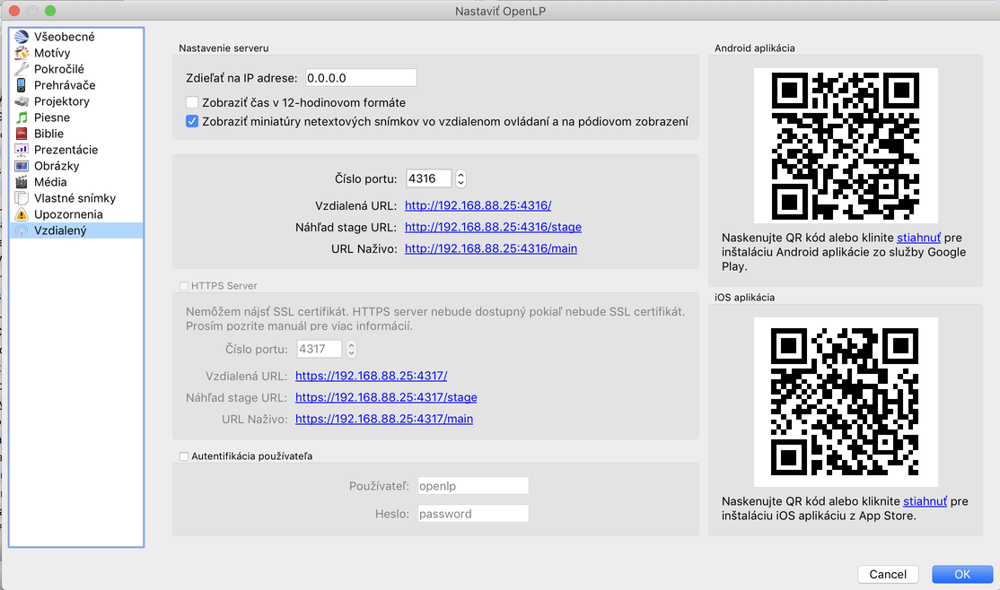
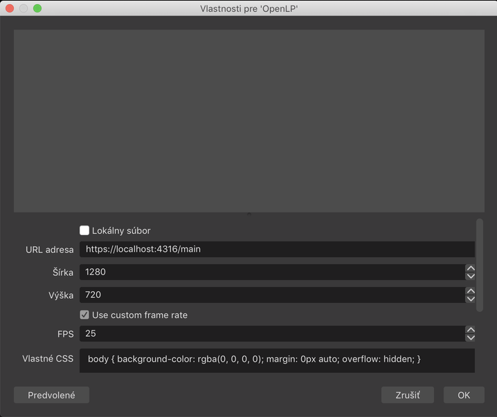
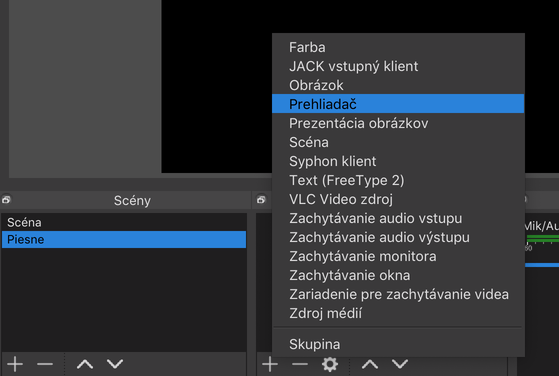
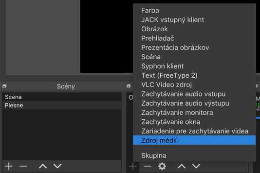
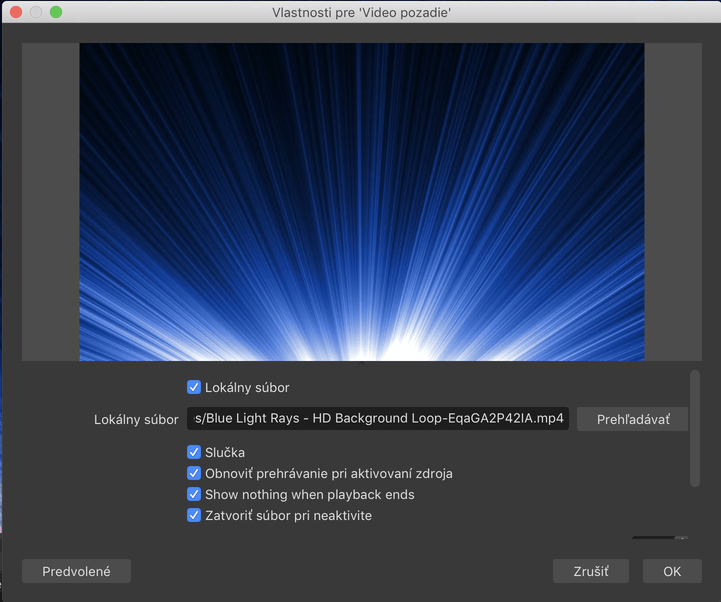
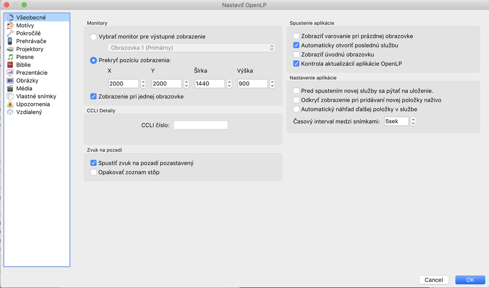
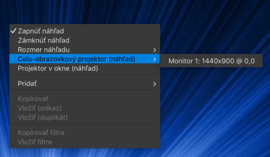

+++
date = "2019-05-30T21:30:00+02:00"
title = "OpenLP video background"
comments = true
description = ""
categories = ["audio-video"]
tags = ["openlp", "obs", "video"]
url = "audio-video/openlp-video-background/"

+++
Na zobrazovanie textov piesní používame [OpenLP](https://openlp.org/) program, ktorý má však už niekoľko verzií problém prekrývať video pozadie prehrávané cez VLC pod ním. Najnovšie riešenie si pomohlo programom [OBS Studio](https://obsproject.com/), ktorý už používame na nahrávanie a live streaming.

OpenLP poskytuje cez remote plugin [zobrazovanie výstupu v html prehliadači](http://manual.openlp.org/stage_view.html#the-live-view) cez adresu http://localhost:4316. Poskytuje 2 typy výstupu:
1. stage view pre spevákov zobrazuje aj nasledujúce verše, čas a slohy
2. main view pre normálny výstup zobrazuje iba aktuálnu slohu v nastavenom motíve

Ten druhý typ výstupu som pridal v OBS do vrstvy Prehliadač s priehľadným pozadím. Podmienkou je, aby aj motív v OpenLP mal priehľadné pozadie.

Pod ňou je vrstva s video pozadím nastavená do slučky. Takýchto vrstiev môže byť v OBS pripravených viac a človek si potom môže prepínať pozadia v OBS.

Výstup OBS je nastavený na projektorový výstup a výstup OpenLP je nastavený na oblasť úplne mimo (napr. start x=2000,y=2000) aby neprekrýval výstup z OBS.

Pravým kliknutím na náhľad v OBS Studio vieme zobraziť výstup na externý monitor alebo projektor.

Ak ste používali v OpenLP na skrývanie titulkov klávesovú skratku D, teraz treba používať T, aby bolo stále vidno video pozadie.

Toto riešenie funguje spoľahlivo aj pre menej technicky zdatných ľudí. Iba prvotné nastavenie si vyžaduje viac technických znalostí. Potom stačí spustiť dva programy a všetko funguje, keďže OpenLP aj OBS si pamätajú nastavenia.
